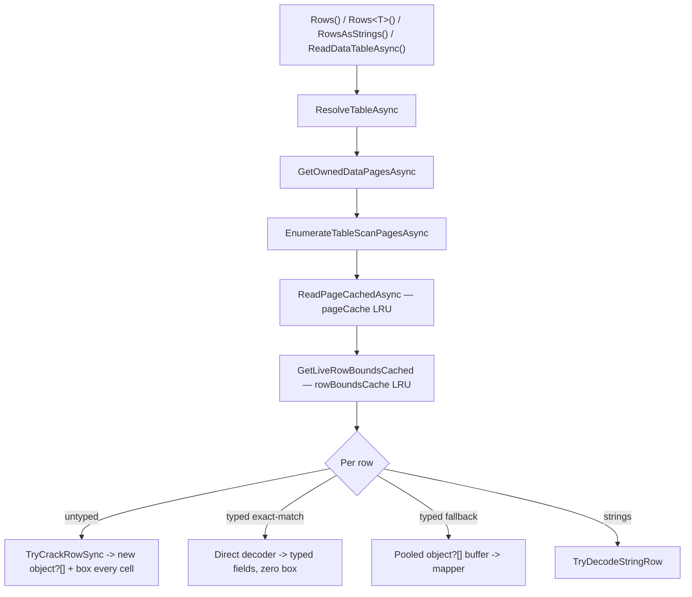

# Simple-read performance improvements

Status: open proposal (evidence-gathered, not yet implemented)
Date: 2026-06-16
Scope: "simple" reads — fixed-width numeric/date, short-text, and wide
non-LVAL tables — through the public `Rows()`, `Rows<T>()`,
`RowsAsStrings()`, and `ReadDataTableAsync()` entry points. MEMO/OLE long
values, complex/attachment, and encryption are explicitly out of scope; those
were settled in the closed baseline
[read-performance-bottlenecks.md](read-performance-bottlenecks.md).

This document is the result of a fresh profiling pass requested specifically for
simple reads. It re-measures the current decoder, isolates where the time and
allocation actually go on the simple-read hot path, and ranks the largest
remaining improvements. It does **not** reopen the closed LVAL / DataTable-
strategy / text-decode threads; it adds new findings (boxing on the untyped
path, a public projection surface, and zero-box-path coverage) that the closed
doc did not cover and explicitly flagged as evidence-gated future ideas.

## TL;DR — the four biggest wins

1. **Stop boxing on the untyped path** (no API change). The untyped `Rows()` /
   `ReadDataTableAsync()` decode allocates a boxed `object` for *every*
   primitive cell. Interning `bool`, caching `byte`, and caching small integers
   eliminates a large fraction of that allocation with zero API or semantic
   change.
2. **Expose projection to untyped callers** (`Rows(table, columns)` and a
   column-subset `ReadDataTableAsync`). The internal decode plan already
   supports a projection mask; wiring it to a public object-array surface cuts
   wide-table allocation by up to ~90% (measured) for callers that cannot define
   a DTO.
3. **Widen the zero-box `Rows<T>()` fast path.** The compiled direct decoder
   only engages on an *exact* CLR-type match. Adding nullable targets and
   widening conversions moves many real DTOs from the boxing fallback onto the
   zero-allocation path.
4. **Collapse the redundant async-iterator layer** in untyped `Rows()`. Every
   row is currently re-yielded through a second pass-through async iterator for
   no functional reason.

Items 5–7 (cold-scan scratch pooling, `LruCache` shared-read lookups, a
synchronous fast-path enumerator) are smaller or more invasive and are listed
after.

## Fresh measurements

BenchmarkDotNet `0.15.8`, ShortRun (3 warmup / 3 iterations), Windows 11,
.NET SDK 10.0.301, .NET 10.0.9, Intel Core Ultra 7 268V. Reader pre-opened in
`[GlobalSetup]`, so these isolate per-row decode from the `OpenAsync` floor.
Fixtures from
[SyntheticDatabases.cs](../../JetDatabaseWriter.Benchmarks/Infrastructure/SyntheticDatabases.cs):
`Numeric` = 25,000 rows × 9 fixed columns, `TextHeavy` = 25,000 rows × 6 text
columns, `Wide` = 10,000 rows × 40 columns.

| Benchmark | Fixture | Mean | Allocated | Notes |
|---|---:|---:|---:|---|
| `Decode_Numeric_Untyped` | 25K × 9 | 9.75 ms | 8,583 KB | Object-array; boxes every cell. |
| `Decode_Numeric_Typed` | 25K × 9 | 12.21 ms | 3,759 KB | Direct decoder; **<½ the allocation**. |
| `Decode_Numeric_AsStrings` | 25K × 9 | 15.88 ms | 9,350 KB | String per cell. |
| `Decode_Numeric_DataTable` | 25K × 9 | 25.08 ms | 11,181 KB | Full materialization. |
| `Decode_Text_Untyped` | 25K × 6 | 24.20 ms | 12,663 KB | Strings inherent; plus boxing of any non-text cell. |
| `Decode_Text_Typed` | 25K × 6 | 26.04 ms | 11,920 KB | |
| `Decode_Text_DataTable` | 25K × 6 | 59.58 ms | 15,552 KB | ~2.5× the streaming time. |
| `Decode_Wide_Untyped` | 10K × 40 | 15.86 ms | 16,485 KB | Decodes **all 40** columns. |
| `Decode_Wide_Typed_NarrowProjection` | 10K × 40 | 10.66 ms | 1,725 KB | Binds 4 columns — **~90% less**. |
| `Decode_Numeric_Untyped_TwoPass` | 25K × 9 ×2 | 10.92 ms | 15,705 KB | Warm rescan; row-bounds cache helps time, boxing still dominates allocation. |
| `Decode_Numeric_ColdOpen_FirstScan` | 25K × 9 | 16.99 ms | 11,069 KB | Includes cold page + row-bounds scratch. |

### What the numbers say

The single object-array row for the numeric fixture is small:

$$
\text{array bytes} = 16_{\text{header}} + 9 \times 8_{\text{ref}} = 88\ \text{B}
\quad\Rightarrow\quad 25{,}000 \times 88 \approx 2.1\ \text{MB}
$$

But the benchmark allocates **8.58 MB**. The missing ~6.5 MB is *boxing*: each
of the nine value-type cells is boxed into its own heap object (≈24–32 B each):

$$
25{,}000 \times 9 \times \approx 28\ \text{B} \approx 6.3\ \text{MB}
$$

That is why `Decode_Numeric_Typed` (the compiled direct decoder, which writes
straight into typed fields with no boxing) allocates less than half as much, and
why narrow-projection on the wide table allocates ~90% less. **Boxing and
decoding-unwanted-columns are the two dominant allocation sources on the
simple-read path**, and the three top recommendations attack exactly those.

## The hot path



Per-page work (`ReadPageCachedAsync`,
[AccessReader.cs#L2826](../../JetDatabaseWriter/AccessReader.cs#L2826), and
`GetLiveRowBoundsCached`,
[AccessReader.cs#L2870](../../JetDatabaseWriter/AccessReader.cs#L2870)) is well
cached. The remaining per-*row* cost is where the simple-read budget is spent.

---

## 1. Eliminate per-cell boxing on the untyped path

**Biggest no-API-change win.**

The untyped decode returns `object?[]`, and every fixed-width cell is boxed.
Today there is **no box cache** anywhere in the decoder:

- Booleans box on every cell — `ColumnSliceKind.Bool => slice.BoolValue` in
  `RowDecodePlan.DecodeTypedValue`
  ([RowDecodePlan.cs#L502](../../JetDatabaseWriter/ValueDecoding/RowDecodePlan.cs#L502)).
- Bytes box on every cell — `ByteType => row[start]` in
  `JetTypeInfo.ReadFixedTyped`
  ([JetTypeInfo.cs#L293](../../JetDatabaseWriter/Schema/JetTypeInfo.cs#L293)).
- Small integers (`short`/`int` status, enum, flag, quantity columns) box on
  every cell — `IntegerType => Ri16(...)`, `LongIntegerType => Ri32(...)`
  ([JetTypeInfo.cs#L287](../../JetDatabaseWriter/Schema/JetTypeInfo.cs#L287)).

`DBNull.Value` is already a singleton, which is the existing precedent that
shared, immutable boxed read-results are acceptable in row arrays.

### Proposed change

Introduce a small internal box cache used by the fixed-width typed decode:

- `bool`: two interned boxes (`true` / `false`) — eliminates **100%** of boolean
  cell boxing.
- `byte`: a 256-entry table (`0..255`) — eliminates **100%** of byte cell
  boxing.
- small `int`/`short`: a cache over a low range (e.g. `-1..256`, mirroring the
  runtime's own small-integer caches) — interns the very common
  status/enum/flag/quantity columns.

Boxed value types are immutable, so a shared box can never be observed as
mutated by a caller; the only behavioral change is that two equal low-magnitude
cells may become reference-equal, which is benign (and arguably more correct).

### Impact and risk

- **Impact:** removes all `bool`/`byte` cell allocation and the bulk of
  low-cardinality integer allocation on `Rows()`, `ReadDataTableAsync()`, and the
  typed *fallback* path that still produces an `object?[]`. Directly reduces the
  Gen0/Gen1 pressure visible in the table above (numeric untyped shows
  ~1,390 Gen0 + ~453 Gen1 collections per 1,000 ops). Status/flag/enum-heavy
  schemas — common in real Access databases — benefit the most.
- **Inherent limit:** high-cardinality columns (IDs, prices, timestamps) cannot
  be interned; for those, the *only* ways to avoid the box are recommendations
  **2** (don't decode the column) and **3** (decode into a typed field). The
  three are complementary.
- **Risk:** very low. No API or null-semantics change.
- **Where:** [JetTypeInfo.cs#L287](../../JetDatabaseWriter/Schema/JetTypeInfo.cs#L287),
  [RowDecodePlan.cs#L493](../../JetDatabaseWriter/ValueDecoding/RowDecodePlan.cs#L493).

---

## 2. Public projection for untyped reads

**Biggest win for wide tables.**

`Decode_Wide_Untyped` decodes and boxes all 40 columns (16.5 MB);
`Decode_Wide_Typed_NarrowProjection` binds 4 and allocates 1.7 MB — a **~90%
allocation reduction and ~33% time reduction**. The projection machinery already
exists internally: `RowDecodePlan` carries a `wantedColumns` mask
([RowDecodePlan.cs#L208](../../JetDatabaseWriter/ValueDecoding/RowDecodePlan.cs#L208)),
and the typed fallback already uses it. The benefit is simply **not reachable**
from the object-array API today — the only public `Rows` overloads are
whole-row ([IAccessReader.cs#L268](../../JetDatabaseWriter/Interfaces/IAccessReader.cs#L268)).

### Proposed change

Add column-selection overloads that thread an existing-feature mask through to
the decoder:

```csharp
IAsyncEnumerable<object?[]> Rows(string tableName, IReadOnlyList<string> columns, ...);
ValueTask<DataTable> ReadDataTableAsync(string tableName, IReadOnlyList<string> columns, ...);
```

Internally: resolve the requested names to a `bool[]` mask and reuse
`RowDecodePlan.CreateTyped(td, wantedColumns, ...)` plus the existing pooled
`object?[]` buffer path. Returned rows contain only the selected ordinals (or
the full width with unwanted slots left `null`, decided by the chosen shape).

### Impact and risk

- **Impact:** up to ~90% allocation and ~⅓ time on wide tables; scales with the
  fraction of unused columns. This is the highest-leverage option for callers
  who genuinely need `object[]`/`DataTable` (UI grids, exports) and cannot adopt
  a DTO.
- **Risk:** low — additive API; the underlying mask path is already exercised by
  `Rows<T>()`'s fallback and is covered by tests. Combine with **1** so the
  *selected* low-cardinality columns also avoid boxing.

---

## 3. Widen the zero-box direct-decoder coverage

`Rows<T>()` can compile a direct page→`T` decoder that writes straight into
typed fields with **no `object?[]` and no boxing**
([DirectRowDecoderBuilder.cs](../../JetDatabaseWriter/ValueDecoding/DirectRowDecoderBuilder.cs)).
That path is why typed numeric decode allocates less than half of untyped. But
it engages only on an **exact** CLR-type match:

```csharp
// DirectRowDecoderBuilder.IsDirectlyDecodable
return JetTypeInfo.GetClrType(colType) == targetUnderlying;
```

[DirectRowDecoderBuilder.cs#L286](../../JetDatabaseWriter/ValueDecoding/DirectRowDecoderBuilder.cs#L286).
Any mismatch drops the whole table to the boxing fallback. Common DTO shapes
that miss the fast path today:

- **Nullable targets** (`int?`, `DateTime?`, `decimal?`) — extremely common, yet
  not matched.
- **Widening** (`Integer`→`long`, `Float`→`double`, integer→`decimal`).

### Proposed change

Extend `IsDirectlyDecodable` and the expression emitter to accept:

- a `Nullable<TUnderlying>` target whenever `TUnderlying` is already directly
  decodable (wrap the decoded value, map null/empty slice to `null`); and
- a small set of safe widening conversions that cannot lose information.

### Impact and risk

- **Impact:** moves a large class of real DTOs (anything with a nullable or
  widened field) from the boxing fallback to the zero-allocation path — the same
  <½ allocation already demonstrated by `Decode_Numeric_Typed`.
- **Risk:** medium. Must preserve the fallback's overflow and null-to-`DBNull`
  semantics. Gate behind focused round-trip tests per added conversion.

---

## 4. Collapse the redundant async-iterator forwarding in untyped `Rows()`

**Status: implemented (2026-06-16).**

Untyped `Rows()` called a 4-argument `EnumerateTypedRowsAsync` that did
nothing but `await foreach` over the 5-argument overload and re-`yield return`
each row. It had exactly one caller and added a second async state machine and an
extra `MoveNextAsync` + yield hop **per row** for no functional purpose.

### Change

Deleted the 4-arg pass-through; untyped `Rows()` now calls the 5-arg overload
with `wantedColumns: null` directly (the string and typed paths already drove
their enumerators without this extra layer). Validated by the Reader and
RoundTrip test namespaces with no behavior change.

### Impact and risk

- **Impact:** removes one async-iterator boundary per row across the largest
  untyped scans. Small constant-time saving, zero allocation regression.
- **Risk:** very low — mechanical refactor; behavior identical.

---

## 5. Pool the cold-scan row-bounds scratch arrays

`ComputeLiveRowBoundsArray` allocates **two** `int[numRows]` scratch arrays for
every page on the cold (cache-miss) pass:

```csharp
int[] rawOffsets = new int[numRows];
int[] positions  = new int[numRows];
```

[AccessBase.cs#L1504](../../JetDatabaseWriter/AccessBase.cs#L1504). Warm rescans
already skip this via `rowBoundsCache`, so this only targets the cold first
scan, but `numRows` is bounded (≤ `pageSize/2` offset entries — a few hundred),
which makes it a good `ArrayPool<int>` rent/return or a `stackalloc` for small
counts.

- **Impact:** removes the cold-scan scratch allocation (part of the 11 MB seen
  in `Decode_Numeric_ColdOpen_FirstScan`); modest but free.
- **Risk:** low; keep the existing clamp/sort logic.
- **Where:** [AccessBase.cs#L1483](../../JetDatabaseWriter/AccessBase.cs#L1483).

---

## 6. Give `LruCache` a real shared-read lookup

`LruCache.TryGetValue` always takes the **write** lock, even though its own XML
comment claims "concurrent readers (cache hits that don't MoveToFront) pay only
the shared-lock cost":

```csharp
public bool TryGetValue(TKey key, out TValue value)
{
    this.rwLock.EnterWriteLock();   // always exclusive
```

[LruCache.cs#L100](../../JetDatabaseWriter/Infrastructure/LruCache.cs#L100). The
cache is consulted per *page*, not per row, so single-threaded impact is small —
but it serializes concurrent scans on the same reader and the documentation is
currently inaccurate.

### Proposed change

Make the hit path use a shared read lock. Because `MoveToFront` mutates the
recency list, either (a) approximate LRU by skipping the reorder on a read-locked
hit (clock-style), or (b) record recency with an atomic counter and reorder
lazily under the write lock only on insert/evict.

- **Impact:** concurrency throughput for shared readers; corrects the doc.
- **Risk:** medium — cache-locking change; must preserve eviction correctness.
  The operation gate
  ([AsyncReentrantOperationGate.cs](../../JetDatabaseWriter/Infrastructure/AsyncReentrantOperationGate.cs))
  permits concurrent top-level operations, so the lock cannot simply be removed.

---

## 7. (Tier 3) Synchronous fast-path enumeration for fully-cached simple scans

For non-LVAL tables with a warm page cache, every per-row `ValueTask` already
completes synchronously (`CrackRowTypedAsync` returns a sync-completed
`ValueTask` when no long-value walk is needed). Yet `IAsyncEnumerable` still pays
`MoveNextAsync` state-machine overhead per row. A synchronous
`IEnumerable<object?[]>` / `IEnumerable<T>` overload (or a buffered
`IReadOnlyList<T>` materializer) would remove that overhead for in-memory scans.

- **Impact:** per-row state-machine overhead on the hottest fully-cached scans.
- **Risk:** medium — new public surface; must not duplicate decode logic. Lower
  priority than 1–4.

---

## Note on `DataTable` and `RowsAsStrings`

`ReadDataTableAsync` remains ~2–2.5× slower than streaming
(numeric 25.1 ms vs 9.75 ms; text 59.6 ms vs 24.2 ms) because it fully
materializes rows and assigns every cell through `DataRow`. This matches the
closed baseline's decision to keep the current `NewRow` insertion strategy. The
boxing fix (**1**) and the column-subset overload (**2**) both flow through to
`DataTable`, so no separate `DataTable`-strategy change is proposed here — the
guidance to prefer streaming APIs in hot paths stands.

`RowsAsStrings` must allocate a `string` per cell by contract, so its allocation
floor is inherent; it is not a target beyond what **4**/**5** give it for free.

## Recommended order

1. **#1 box interning** — no API change, broad benefit, lowest risk. Do first.
2. **#4 collapse forwarding** (done) and **#5 scratch pooling** — small, safe;
   land #5 alongside #1.
3. **#2 public projection** — highest wide-table leverage; additive API.
4. **#3 widen direct decoder** — extends the zero-box path; needs per-conversion
   tests.
5. **#6 LruCache shared-read** and **#7 sync enumeration** — only with a
   concurrency or in-memory-scan profile that justifies the locking/API change.

## Validation plan

Re-run the focused row-decode benchmarks before/after each change and compare
mean **and** allocated bytes:

```powershell
dotnet run --project JetDatabaseWriter.Benchmarks -c Release -- --filter *AccessReaderRowDecodeBenchmarks* --job short
```

Targeted expectations:

- **#1:** `Decode_Numeric_Untyped` and `Decode_Numeric_DataTable` allocation
  drop (largest on bool/byte/small-int-heavy schemas); mean neutral-or-better.
- **#2:** a new wide-projection untyped benchmark should approach
  `Decode_Wide_Typed_NarrowProjection` (≈1.7 MB) rather than 16.5 MB.
- **#3:** a nullable/widened DTO benchmark should drop from the untyped-like
  allocation onto the `Decode_Numeric_Typed` (≈3.8 MB) profile.
- **#4/#5:** mean neutral-or-better, no allocation regression; #5 lowers
  `Decode_Numeric_ColdOpen_FirstScan` allocation.

Drop any change whose measured delta does not justify its complexity, per the
evidence-gated policy in
[read-performance-bottlenecks.md](read-performance-bottlenecks.md).

## Relationship to the closed baseline

The closed [read-performance-bottlenecks.md](read-performance-bottlenecks.md)
covers LVAL/MEMO/OLE decode, `DataTable` insertion strategy, text decode,
owned-page discovery, and table-scan read-ahead, and lists "public object-array
projection API," "projected/typed index seek," and "lazy long-value access" as
evidence-gated future ideas. This document supplies fresh evidence for the
**object-array projection** idea (#2) and adds two areas that the closed pass did
not analyze for the *untyped* simple-read path: **per-cell boxing** (#1) and
**direct-decoder coverage** (#3). It does not contradict any closed decision.
