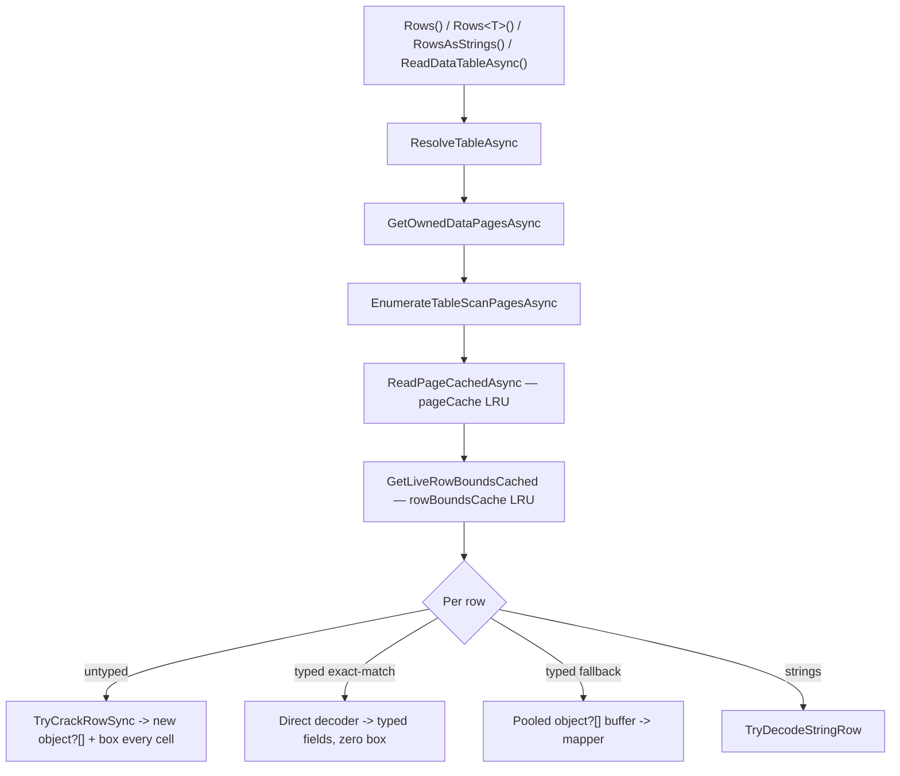

# Simple-read performance improvements

Status: implemented and closed (2026-06-16 – 2026-06-30). Sections 1 and 3–6 shipped. Section 2 (a public projection surface for untyped callers) is deferred — not rejected outright, but not built without a concrete dynamic-column caller, because the headline wide-table win is already reachable today via a narrow `Rows<T>()` DTO (see section 2). Section 7 (synchronous fast-path enumeration) is rejected as net API bloat with no supporting evidence (see section 7).
Date: 2026-06-16 (status refreshed 2026-06-30)
Scope: "simple" reads — fixed-width numeric/date, short-text, and wide
non-LVAL tables — through the public `Rows()`, `Rows<T>()`,
`RowsAsStrings()`, and `ReadDataTableAsync()` entry points. MEMO/OLE long
values, complex/attachment, and encryption are explicitly out of scope; those
were settled in the closed baseline
[read-performance-bottlenecks.md](read-performance-bottlenecks.md).

This document is the result of a fresh profiling pass requested specifically for
simple reads. It re-measures the current decoder, isolates where the time and
allocation actually go on the simple-read hot path, and ranks the largest
remaining improvements. It does **not** reopen the closed LVAL / DataTable-
strategy / text-decode threads; it adds new findings (boxing on the untyped
path, a public projection surface, and zero-box-path coverage) that the closed
doc did not cover and explicitly flagged as evidence-gated future ideas.

## TL;DR — the four biggest wins

*Status (2026-06-30): wins 1, 3, and 4 shipped; items 5–6 also shipped. Win 2 (public projection for untyped callers) is deferred until a concrete dynamic-column caller exists — its headline win is already reachable via a narrow `Rows<T>()` DTO. Item 7 is rejected. See the per-section status lines for details.*

1. **Stop boxing on the untyped path** (no API change). The untyped `Rows()` /
   `ReadDataTableAsync()` decode allocates a boxed `object` for *every*
   primitive cell. Interning `bool`, caching `byte`, and caching small integers
   eliminates a large fraction of that allocation with zero API or semantic
   change.
2. **Expose projection to untyped callers** (`Rows(table, columns)` and a
   column-subset `ReadDataTableAsync`) — **deferred**. The internal decode plan
   already supports a projection mask, and wiring it to a public object-array
   surface would cut wide-table allocation by up to ~90% (measured). But that
   ~90% win is *already reachable today* via a narrow `Rows<T>()` DTO (it is the
   `Decode_Wide_Typed_NarrowProjection` benchmark), so this overload only adds
   value for callers choosing columns at runtime who cannot name a DTO. Held
   until such a caller exists; see section 2.
3. **Widen the zero-box `Rows<T>()` fast path.** The compiled direct decoder
   only engages on an *exact* CLR-type match. Adding nullable targets and
   widening conversions moves many real DTOs from the boxing fallback onto the
   zero-allocation path.
4. **Collapse the redundant async-iterator layer** in untyped `Rows()`. Every
   row is currently re-yielded through a second pass-through async iterator for
   no functional reason.

Items 5–7 (cold-scan scratch pooling, `LruCache` shared-read lookups, a
synchronous fast-path enumerator) are smaller or more invasive and are listed
after.

## Fresh measurements

BenchmarkDotNet `0.15.8`, ShortRun (3 warmup / 3 iterations), Windows 11,
.NET SDK 10.0.301, .NET 10.0.9, Intel Core Ultra 7 268V. Reader pre-opened in
`[GlobalSetup]`, so these isolate per-row decode from the `OpenAsync` floor.
Fixtures from
[SyntheticDatabases.cs](../../JetDatabaseWriter.Benchmarks/Infrastructure/SyntheticDatabases.cs):
`Numeric` = 25,000 rows × 9 fixed columns, `TextHeavy` = 25,000 rows × 6 text
columns, `Wide` = 10,000 rows × 40 columns.

| Benchmark | Fixture | Mean | Allocated | Notes |
|---|---:|---:|---:|---|
| `Decode_Numeric_Untyped` | 25K × 9 | 9.75 ms | 8,583 KB | Object-array; boxes every cell. |
| `Decode_Numeric_Typed` | 25K × 9 | 12.21 ms | 3,759 KB | Direct decoder; **<½ the allocation**. |
| `Decode_Numeric_AsStrings` | 25K × 9 | 15.88 ms | 9,350 KB | String per cell. |
| `Decode_Numeric_DataTable` | 25K × 9 | 25.08 ms | 11,181 KB | Full materialization. |
| `Decode_Text_Untyped` | 25K × 6 | 24.20 ms | 12,663 KB | Strings inherent; plus boxing of any non-text cell. |
| `Decode_Text_Typed` | 25K × 6 | 26.04 ms | 11,920 KB | |
| `Decode_Text_DataTable` | 25K × 6 | 59.58 ms | 15,552 KB | ~2.5× the streaming time. |
| `Decode_Wide_Untyped` | 10K × 40 | 15.86 ms | 16,485 KB | Decodes **all 40** columns. |
| `Decode_Wide_Typed_NarrowProjection` | 10K × 40 | 10.66 ms | 1,725 KB | Binds 4 columns — **~90% less**. |
| `Decode_Numeric_Untyped_TwoPass` | 25K × 9 ×2 | 10.92 ms | 15,705 KB | Warm rescan; row-bounds cache helps time, boxing still dominates allocation. |
| `Decode_Numeric_ColdOpen_FirstScan` | 25K × 9 | 16.99 ms | 11,069 KB | Includes cold page + row-bounds scratch. |

### What the numbers say

The single object-array row for the numeric fixture is small:

$$
\text{array bytes} = 16_{\text{header}} + 9 \times 8_{\text{ref}} = 88\ \text{B}
\quad\Rightarrow\quad 25{,}000 \times 88 \approx 2.1\ \text{MB}
$$

But the benchmark allocates **8.58 MB**. The missing ~6.5 MB is *boxing*: each
of the nine value-type cells is boxed into its own heap object (≈24–32 B each):

$$
25{,}000 \times 9 \times \approx 28\ \text{B} \approx 6.3\ \text{MB}
$$

That is why `Decode_Numeric_Typed` (the compiled direct decoder, which writes
straight into typed fields with no boxing) allocates less than half as much, and
why narrow-projection on the wide table allocates ~90% less. **Boxing and
decoding-unwanted-columns are the two dominant allocation sources on the
simple-read path**, and the three top recommendations attack exactly those.

## The hot path



Per-page work (`ReadPageCachedAsync`,
[AccessReader.cs#L2826](../../JetDatabaseWriter/AccessReader.cs#L2826), and
`GetLiveRowBoundsCached`,
[AccessReader.cs#L2870](../../JetDatabaseWriter/AccessReader.cs#L2870)) is well
cached. The remaining per-*row* cost is where the simple-read budget is spent.

---

## 1. Eliminate per-cell boxing on the untyped path (DONE)

**Status: implemented (2026-06-29).**

The untyped decode returns `object?[]`, and every fixed-width cell was boxed
into its own heap object. There was **no box cache** anywhere in the decoder:

- Booleans boxed on every cell — `ColumnSliceKind.Bool => slice.BoolValue` in
  `RowDecodePlan.DecodeTypedValue`.
- Bytes boxed on every cell — `ByteType => row[start]` in
  `JetTypeInfo.ReadFixedTyped`.
- Small integers (`short`/`int` status, enum, flag, quantity columns) boxed on
  every cell — `IntegerType => Ri16(...)`, `LongIntegerType => Ri32(...)`.

`DBNull.Value` is already a singleton, which is the existing precedent that
shared, immutable boxed read-results are acceptable in row arrays.

### Change

Added an internal `BoxCache`
([BoxCache.cs](../../JetDatabaseWriter/Infrastructure/BoxCache.cs)) of interned
boxes and routed the fixed-width typed decode through it:

- `bool`: two interned boxes (`true` / `false`) — eliminates **100%** of boolean
  cell boxing. Consumed by `RowDecodePlan.DecodeTypedValue`
  (`ColumnSliceKind.Bool => BoxCache.Bool(slice.BoolValue)`).
- `byte`: a 256-entry table (`0..255`) — eliminates **100%** of byte cell
  boxing. Consumed by `JetTypeInfo.ReadFixedTyped`
  (`ByteType => BoxCache.Byte(row[start])`).
- small `short`/`int`: a `-1..256` table mirroring the runtime's own
  small-integer caches — interns the very common status/enum/flag/quantity
  columns. Consumed by `JetTypeInfo.ReadFixedTyped`
  (`IntegerType => BoxCache.Int16(...)`, `LongIntegerType => BoxCache.Int32(...)`).
  Values outside the cached window fall back to a normal box, so the contract is
  unchanged.

Each accessor preserves the exact boxed CLR type (`bool`/`byte`/`short`/`int`),
so the `Integer` column still yields a boxed `short` and `LongInteger` a boxed
`int` — no widening. High-cardinality types (`Money`, `Double`, `DateTime`,
`BigInt`, `Guid`, `Numeric`) are deliberately left boxing per cell. Boxed value
types are immutable, so a shared box can never be observed as mutated; the only
behavioural change is that two equal low-magnitude cells become reference-equal,
which is benign (mirroring the long-standing shared `DBNull.Value`).

### Impact and risk

- **Impact:** removes all `bool`/`byte` cell allocation and the bulk of
  low-cardinality integer allocation on `Rows()`, `ReadDataTableAsync()`, and the
  typed *fallback* path that still produces an `object?[]`. Directly reduces the
  Gen0/Gen1 pressure visible in the table above (numeric untyped showed
  ~1,390 Gen0 + ~453 Gen1 collections per 1,000 ops). Status/flag/enum-heavy
  schemas — common in real Access databases — benefit the most.
- **Measured (2026-06-29, ShortRun, same host as the baseline table):**
  `Decode_Numeric_Untyped` 8.38 MB → 6.45 MB (−23%),
  `Decode_Numeric_DataTable` 10.92 MB → 8.96 MB (−18%),
  `Decode_Numeric_Untyped_TwoPass` 15.34 MB → 11.83 MB (−23%), and
  `Decode_Numeric_ColdOpen_FirstScan` 10.81 MB → 8.64 MB (−20%); the zero-box
  `Decode_Numeric_Typed` (3.67 → 3.50 MB) and `Decode_Numeric_AsStrings`
  (9.13 → 8.92 MB) are neutral, as expected. Untyped-scan GC fell from
  ~1,390/~453 to ~1,078/~359 Gen0/Gen1 per 1,000 ops. Only 3 of the fixture's 9
  columns are interning-eligible (`ProductId` 1–200, `Quantity` 1–50, `StatusId`
  1–5), so they account for the entire ~1.9 MB drop; a flag/enum-heavy schema
  would gain more. Means are noisy under ShortRun, so only allocation (measured
  deterministically by `MemoryDiagnoser`) is reported.
- **Inherent limit:** high-cardinality columns (IDs, prices, timestamps) cannot
  be interned; for those, the *only* ways to avoid the box are recommendations
  **2** (don't decode the column) and **3** (decode into a typed field). The
  three are complementary.
- **Risk:** very low — no API or null-semantics change. Covered by per-accessor
  unit tests in
  [BoxCacheTests.cs](../../JetDatabaseWriter.Tests/Infrastructure/BoxCacheTests.cs)
  (boxed-type correctness, value correctness, in-range interning, and
  out-of-range fallback) plus the Reader, ValueDecoding, Schema, and RoundTrip
  namespaces with no behaviour change.
- **Where:** [BoxCache.cs](../../JetDatabaseWriter/Infrastructure/BoxCache.cs),
  [JetTypeInfo.cs](../../JetDatabaseWriter/Schema/JetTypeInfo.cs),
  [RowDecodePlan.cs](../../JetDatabaseWriter/ValueDecoding/RowDecodePlan.cs).

---

## 2. Public projection for untyped reads (DEFERRED)

**Status: deferred (2026-06-30) — not built without a concrete dynamic-column
caller.** The measured win is real, but it is already reachable today through a
narrower API, which collapses the value of adding new surface.

`Decode_Wide_Untyped` decodes and boxes all 40 columns (16.5 MB);
`Decode_Wide_Typed_NarrowProjection` binds 4 and allocates 1.7 MB — a **~90%
allocation reduction and ~33% time reduction**. The projection machinery already
exists internally: `RowDecodePlan` carries a `wantedColumns` mask
([RowDecodePlan.cs#L208](../../JetDatabaseWriter/ValueDecoding/RowDecodePlan.cs#L208)),
and the typed fallback already uses it.

### Why deferred

The headline number is the decisive point against building this now: that ~90%
reduction *is* `Decode_Wide_Typed_NarrowProjection`, which is simply `Rows<T>()`
with a four-property DTO. **The wide-table win already ships today.** A caller
who cares about wide-table allocation can name a narrow DTO and land on the
zero-box direct-decoder path — now even wider after section 3.

A public object-array projection therefore does *not* unlock the win; it only
extends it to callers who **cannot name a DTO at compile time** — runtime-chosen
columns (a generic data browser, dynamic export, ad-hoc grid). LINQ `.Select`
does not serve that audience either, because per the contract on
[IAccessReader.cs#L299](../../JetDatabaseWriter/Interfaces/IAccessReader.cs#L299)
projection "run[s] client-side" *after* the full row is decoded and boxed, so it
cannot save the decode cost. That dynamic, no-DTO audience is genuine but niche,
and it does not justify growing the public surface speculatively.

The shape was also unsettled: the original sketch hedged between "only the
selected ordinals" and "full width with unwanted slots left `null`." Shipping an
API whose row shape is decided later is the opposite of a tidy surface.

### If a concrete caller appears

Add **exactly one** tidy entry point for the dynamic case rather than the pair
originally sketched, and resolve the shape to "the row contains exactly the
selected columns, in requested order":

```csharp
// Preferred single entry point — serves the dynamic/no-DTO audience with no
// streaming object?[] twin (streaming callers can adopt Rows<T>()).
ValueTask<DataTable> ReadDataTableAsync(string tableName, IReadOnlyList<string> columns, ...);
```

Internally: resolve the requested names to a `bool[]` mask and reuse
`RowDecodePlan.CreateTyped(td, wantedColumns, ...)` plus the existing pooled
`object?[]` buffer path. Combine with **1** so the *selected* low-cardinality
columns also avoid boxing. The underlying mask path is already exercised by
`Rows<T>()`'s fallback, so the risk would be low — the objection is surface, not
implementation.

---

## 3. Widen the zero-box direct-decoder coverage (DONE)

**Status: implemented (2026-06-16).**

`Rows<T>()` can compile a direct page→`T` decoder that writes straight into
typed fields with **no `object?[]` and no boxing**
([DirectRowDecoderBuilder.cs](../../JetDatabaseWriter/ValueDecoding/DirectRowDecoderBuilder.cs)).
That path is why typed numeric decode allocates less than half of untyped. It
previously engaged only on an **exact** CLR-type match
(`JetTypeInfo.GetClrType(colType) == targetUnderlying`), so any mismatch dropped
the whole table to the boxing fallback.

### Finding

The two shapes the proposal flagged turned out to need different handling:

- **Nullable targets with an exact underlying type** (`int?`←LongInteger,
  `DateTime?`←DateTime) *already* took the fast path. `RowMapper.Accessor`
  stores `TargetType` as the `Nullable`-unwrapped type
  ([RowMapper.cs#L388](../../JetDatabaseWriter/ValueDecoding/RowMapper.cs#L388)),
  so `IsDirectlyDecodable` already matched, and the emitter's
  `Expression.Convert` to the declared property type already lifted `T`→`T?`.
- **Widening** (`Integer`→`long`, `Float`→`double`, integer→`decimal`) was the
  real gap, including its combination with nullable (`long?`←Integer), which
  failed because the unwrapped target (`long`) still did not equal the natural
  type (`short`).

### Change

- `IsDirectlyDecodable` now accepts a target that is a **lossless numeric
  widening** of the column's natural CLR type via a new `IsLosslessWidening`
  table: `byte`→`short`/`int`/`long`/`float`/`double`/`decimal`,
  `short`→`int`/`long`/`float`/`double`/`decimal`,
  `int`→`long`/`double`/`decimal`, `long`→`decimal`, `float`→`double`. The
  precision-losing implicit conversions C# otherwise allows (`int`→`float`,
  `long`→`float`, `long`→`double`) are deliberately **excluded** so the direct
  decoder never yields a value the boxing fallback would not.
- The emitter composes the raw read up to the property type in two steps —
  widen to the `Nullable`-unwrapped target type, then lift to the declared
  property type when it differs — so a widening and a nullable lift combine
  cleanly (`short`→`long`→`long?`). Exact-match columns still emit neither
  `Convert`.

### Impact and risk

- **Impact:** moves nullable-widened and widened DTOs (anything with an
  `Integer`-as-`long`, `Float`-as-`double`, integer-as-`decimal`, or nullable
  thereof field) from the boxing fallback onto the zero-allocation path — the
  same <½ allocation already demonstrated by `Decode_Numeric_Typed`.
- **Risk:** low as shipped. Only lossless widenings are admitted, so no overflow
  is possible and the fallback's null-to-default semantics are preserved (a null
  or empty slice leaves the property at its CLR default, which is `null` for a
  nullable target). Covered by per-conversion unit tests in
  [DirectRowDecoderBuilderTests.cs](../../JetDatabaseWriter.Tests/ValueDecoding/DirectRowDecoderBuilderTests.cs)
  (accepts each widening, rejects each precision-losing/narrowing source) and
  round-trip value tests in
  [DirectDecoderWideningTests.cs](../../JetDatabaseWriter.Tests/Reader/DirectDecoderWideningTests.cs).
- **Where:** [DirectRowDecoderBuilder.cs](../../JetDatabaseWriter/ValueDecoding/DirectRowDecoderBuilder.cs).

---

## 4. Collapse the redundant async-iterator forwarding in untyped `Rows()` (DONE)

**Status: implemented (2026-06-16).**

Untyped `Rows()` called a 4-argument `EnumerateTypedRowsAsync` that did
nothing but `await foreach` over the 5-argument overload and re-`yield return`
each row. It had exactly one caller and added a second async state machine and an
extra `MoveNextAsync` + yield hop **per row** for no functional purpose.

### Change

Deleted the 4-arg pass-through; untyped `Rows()` now calls the 5-arg overload
with `wantedColumns: null` directly (the string and typed paths already drove
their enumerators without this extra layer). Validated by the Reader and
RoundTrip test namespaces with no behavior change.

### Impact and risk

- **Impact:** removes one async-iterator boundary per row across the largest
  untyped scans. Small constant-time saving, zero allocation regression.
- **Risk:** very low — mechanical refactor; behavior identical.

---

## 5. Pool the cold-scan row-bounds scratch arrays (DONE)

**Status: implemented (2026-06-16).**

`ComputeLiveRowBoundsArray` allocated **two** `int[numRows]` scratch arrays for
every page on the cold (cache-miss) pass. Warm rescans already skip this via
`rowBoundsCache`, so it only affected the cold first scan, but `numRows` is
bounded (≤ `pageSize/2` offset entries — a few hundred).

### Change

Both scratch buffers are now rented from `ArrayPool<int>.Shared` and returned in
a `finally`, removing the per-page cold-scan allocation. The existing
clamp/sort/binary-search logic is preserved verbatim — `Array.Sort` and
`Array.BinarySearch` are kept rather than switching to `Span<int>.Sort`, which is
unavailable on the `netstandard2.1` target. Validated by the Reader, Pages, and
RoundTrip test namespaces with no behavior change.

### Impact and risk

- **Impact:** removes the cold-scan scratch allocation (part of the 11 MB seen
  in `Decode_Numeric_ColdOpen_FirstScan`); modest but free.
- **Risk:** low — the clamp/sort logic is unchanged; only the buffer source moved
  from `new int[]` to the shared pool.
- **Where:** [AccessBase.cs#L1483](../../JetDatabaseWriter/AccessBase.cs#L1483).

---

## 6. Give `LruCache` a real shared-read lookup (DONE)

**Status: implemented (2026-06-16).**

`LruCache.TryGetValue` previously always took the **write** lock, even though its
own XML comment claimed "concurrent readers (cache hits that don't MoveToFront)
pay only the shared-lock cost". Because the lookup serialized every cache hit, it
both blocked concurrent scans on a shared reader and made the documentation
inaccurate. The cache is consulted per *page*, not per row, so single-threaded
impact was small, but the operation gate
([AsyncReentrantOperationGate.cs](../../JetDatabaseWriter/Infrastructure/AsyncReentrantOperationGate.cs))
permits concurrent top-level reader operations, so the serialization was real.

### Change

Converted the cache to a CLOCK (second-chance) approximate-LRU so the hit path
runs under the shared **read** lock (option (a) from the original proposal):

- `TryGetValue` now takes `EnterReadLock`. On a hit it records the access by
  setting a per-entry reference bit instead of calling `MoveToFront`, so it never
  mutates the recency list. The reference bit is only ever written to the constant
  `true` by concurrent readers (benign) and is read/cleared exclusively under the
  write lock, which cannot overlap a read-lock holder.
- The deferred reorder happens during eviction: `Add` now selects its victim via
  a `SelectEvictionVictim` CLOCK scan that walks from the LRU end, giving any
  referenced entry a second chance (clear bit + promote to MRU) and evicting the
  first entry whose bit is clear. The scan terminates within a single pass because
  every promotion clears exactly one bit.
- `hits`/`misses` moved from plain `++` to `Interlocked.Increment` (and the
  getters to `Interlocked.Read`) because they are now updated under the shared
  read lock by concurrent readers.

The six existing eviction tests still pass unchanged (the scenarios they cover
produce identical victims under CLOCK), and a new
`Concurrent_TryGetValue_Returns_Correct_Values_And_Counts_Hits_Exactly` test
exercises 8 concurrent readers and asserts both value correctness and an exact
hit count, which the previous lost-update `hits++` could not guarantee.

### Impact and risk

- **Impact:** concurrent cache hits on a shared reader now run in parallel under
  the read lock instead of serializing on the write lock; corrects the XML doc.
- **Risk:** medium (realized) — eviction switched from exact LRU to CLOCK
  approximation. Validated by the full Reader and RoundTrip namespaces plus the
  `LruCache`/reader-cache tests with no behavior change.
- **Where:** [LruCache.cs#L77](../../JetDatabaseWriter/Infrastructure/LruCache.cs#L77),
  [LruCache.cs#L199](../../JetDatabaseWriter/Infrastructure/LruCache.cs#L199).

---

## 7. Synchronous fast-path enumeration for fully-cached simple scans (REJECTED)

**Status: rejected (2026-06-30) — net API bloat with no supporting evidence.**

For non-LVAL tables with a warm page cache, every per-row `ValueTask` already
completes synchronously (`CrackRowTypedAsync` returns a sync-completed
`ValueTask` when no long-value walk is needed). Yet `IAsyncEnumerable` still pays
`MoveNextAsync` state-machine overhead per row. A synchronous
`IEnumerable<object?[]>` / `IEnumerable<T>` overload (or a buffered
`IReadOnlyList<T>` materializer) would remove that overhead for in-memory scans.

### Why rejected

- **No evidence.** This was always gated on an in-memory-scan profiling pass that
  was never run, so building it would be adding public surface on spec. Section 4
  already removed the redundant per-row iterator hop, which is the part that was
  cheaply removable.
- **It roughly doubles the streaming surface** — synchronous twins of `Rows()`,
  `Rows<T>()`, and `RowsAsStrings()` — for a benefit that only materializes on
  already-fully-cached, non-LVAL scans, i.e. the cheapest case that is already
  fast.
- **It is a footgun.** A synchronous enumerator over a page-cached scan silently
  performs blocking I/O on any cache miss — sync-over-async in a library whose
  entire contract is asynchronous — or forces a fragile "must be fully cached"
  precondition that the type system cannot express.

The per-row state-machine overhead is real but small, and the only honest way to
revisit this would be a profile that isolates it *and* a design that does not
duplicate the decode logic. Neither exists, so the item is closed rather than
left as a standing tier-3 invitation.

---

## Note on `DataTable` and `RowsAsStrings`

`ReadDataTableAsync` remains ~2–2.5× slower than streaming
(numeric 25.1 ms vs 9.75 ms; text 59.6 ms vs 24.2 ms) because it fully
materializes rows and assigns every cell through `DataRow`. This matches the
closed baseline's decision to keep the current `NewRow` insertion strategy. The
boxing fix (**1**) already flows through to `DataTable`; the column-subset
overload (**2**) would too if it is ever built, so no separate
`DataTable`-strategy change is proposed here — the guidance to prefer streaming
APIs in hot paths stands.

`RowsAsStrings` must allocate a `string` per cell by contract, so its allocation
floor is inherent; it is not a target beyond what **4**/**5** give it for free.

## Recommended order

1. **#1 box interning** (done) — no API change, broad benefit, lowest risk.
2. **#4 collapse forwarding** (done) and **#5 scratch pooling** (done) — small,
   safe.
3. **#3 widen direct decoder** (done) — extends the zero-box path with lossless
   widening + nullable lift; covered by per-conversion unit and round-trip
   tests.
4. **#6 LruCache shared-read** (done) — concurrent cache hits now run under the
   shared read lock.
5. **#2 public projection** (deferred) — the wide-table win is already reachable
   via a narrow `Rows<T>()` DTO, so this is held until a concrete dynamic-column
   caller justifies the new surface.
6. **#7 sync enumeration** (rejected) — net API bloat with no supporting
   evidence.

## Validation plan

Re-run the focused row-decode benchmarks before/after each change and compare
mean **and** allocated bytes:

```powershell
dotnet run --project JetDatabaseWriter.Benchmarks -c Release -- --filter *AccessReaderRowDecodeBenchmarks* --job short
```

Targeted expectations:

- **#1:** `Decode_Numeric_Untyped` and `Decode_Numeric_DataTable` allocation
  drop (largest on bool/byte/small-int-heavy schemas); mean neutral-or-better.
- **#2 (only if built):** a new wide-projection untyped benchmark should approach
  `Decode_Wide_Typed_NarrowProjection` (≈1.7 MB) rather than 16.5 MB.
- **#3:** a nullable/widened DTO benchmark should drop from the untyped-like
  allocation onto the `Decode_Numeric_Typed` (≈3.8 MB) profile.
- **#4/#5:** mean neutral-or-better, no allocation regression; #5 lowers
  `Decode_Numeric_ColdOpen_FirstScan` allocation.

Drop any change whose measured delta does not justify its complexity, per the
evidence-gated policy in
[read-performance-bottlenecks.md](read-performance-bottlenecks.md).

## Relationship to the closed baseline

The closed [read-performance-bottlenecks.md](read-performance-bottlenecks.md)
covers LVAL/MEMO/OLE decode, `DataTable` insertion strategy, text decode,
owned-page discovery, and table-scan read-ahead, and lists "public object-array
projection API," "projected/typed index seek," and "lazy long-value access" as
evidence-gated future ideas. This document supplies fresh evidence for the
**object-array projection** idea (#2) — concluding it should *not* be built
without a concrete dynamic-column caller, because the wide-table win is already
reachable through a narrow `Rows<T>()` DTO — and adds two areas that the closed
pass did not analyze for the *untyped* simple-read path: **per-cell boxing** (#1)
and **direct-decoder coverage** (#3). It does not contradict any closed decision.
